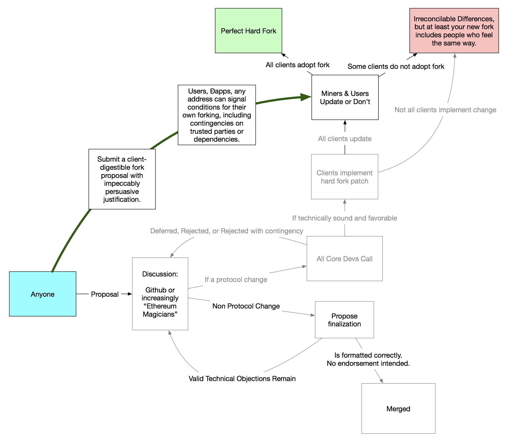

# Ethereum Strangeloop Proposal

## Motivations

Hard forking allows protocol evolution, and other potentially valuable community services (cough, funds recovery), but contentious forks today can divide network value and create excessive overhead for that blockchain's community.

Currently, one stance that is popularly presented is "no forks" as the simplest solution to keeping one chain, but if forks can be made less contentiously, and with less overhead, we should consider that system.

## Background

At the EIP0 unconference, we discussed governance and how it can work at various layers of Ethereum. While layer two solutions, and even layer one solutions can be useful, interesting, and maybe necessary in the long term, when there are bugs or contention in the protocol itself, hard forking is the only option for resolving those issues, and so my focus in this proposal is on smoothing out the process of making hard forks less contentious.



Here is a flow chart, showing which parts of the current process could be bypassed.

I do not claim that this solves contentious hard forks, but I will present a framework that allows networks of people to assemble and strongly signal the ideals of their preferred blockchain, and allow clean forks along these ideological lines, avoiding the "infinite immutability debate" loop that the Ethereum blockchain is currently in.

## Introduction

I will propose a framework for the development of some infrastructure that can be built on top of Ethereum today, with no hard forks, that can allow community members to strongly align along their blockchain ideologies. Any governance layer can be placed within this framework, and each user ultimately has control of their own client, which this framework fully respects.

I call this proposal Strangeloop as a nod to Douglas Hofstadter's "Gödel, Escher, Bach". A strange loop is a system that has some self reflection, and so a capacity for self improvement. By bending from within the protocol to without, I believe we can complete a strange loop, and make Ethereum the self improving yet community representative system that it should be.

As you'll see, this proposal lives on layer 2 and layer 0, with some possible optimizations at layer 1. Since it links layer 2 and 0, it forms a feedback loop.

## Implementation

### Consistent Hard Fork Proposal Format

[EIP 867](https://github.com/ethereum/EIPs/pull/867) is merged, but no one is currently proposing their fund recoveries in this format. Part of this is because the advantage of using the format today is small: While the format is machine readable, no machines currently read it.

The first step is to create a smart contract registry for people to publish these hard fork proposals (by hash), with that hash readily available over p2p file sharing protocols.

### Client Optimization

This proposal would greatly benefit from the client developers taking the time to make it easy for their clients to consume proposals posted to this registry, and expose those fork choices as parameters to their clients, so that clients are more freely in control of their own fork choice rules. If clients implement this one generic feature, they would no longer have overhead of implementing state change hard fork proposals.

This isn't required, but users who are fork friendly are likely to pursue clients that give them the most control over their fork choice rules.

### Fork Signaling Framework

A new smart contract format should be developed, that allows a user to define whether at that moment they are in favor of any given fork or not. This could be as simple as anyone publishing a contract that exposes one method:

```
function supportsProposal(address proposal) returns (bool);
// maybe shouldn't return bool, but a ternary, to support "undecided".
```

Under the hood, this user can use any method they want, either hard-coding their current opinions, delegating to a friend or a distribution of trusted others, or delegating to a democracy. It's up to that user.

### User Client Wrappers for Fork Choosing

The last layer is a program users can use to wrap their Ethereum clients, which knows how to pass hard fork parameters to that client.

There can be many implementations of this client wrapper, and this layer should represent that user's preference for choosing hard forks.

One simple example would be a coin voting scheme, where a user prefers to point at some carbon-vote `supportsProposal` implementation, and just goes with the coin majority.

A verion of this wrapper that I personally prefer involves delegating trust, in a liquid-democracy like way, but with the ability to assign quorums. For example:

- I'll do any fork that I explicitly publicly supported.
- If I haven't voiced an opinion publicly, and if 95 of the 100 stake holders I follow signal they will fork, then fork.

Or maybe:
- If any one person from team A supports it, AND any two people from team B, AND everyone from team C, then fork.

I think that this kind of transitive trust with a quorum model is powerful because it allows users to require very high degrees of consensus before agreeing to a hard fork, while also allowing users to align their fork choice rules along the ideologies that most appeal to them. As long as these communities stay aligned to their purposes, after an (ideally early) ideological hard fork, the split ideology chains should be able to live in peace and parallel, even potentially communicating via hubs and relays.

For more signaling strategies, check out:
- [Soft Flow](./signaling-methods/soft-flow.md)
- [Hard Flow](./signaling-methods/hard-flow.md)

## Conclusion

Since users can implement any fork choice rule they want, and some forks are good decisions, and forks are most powerful when keeping the most people in sync at once, I think signaling with high quorum requirements could be a powerful "good enough" hard-fork governance framework for users to start iterating on what mechanisms they think are most effective for coordinating on hard forks.

